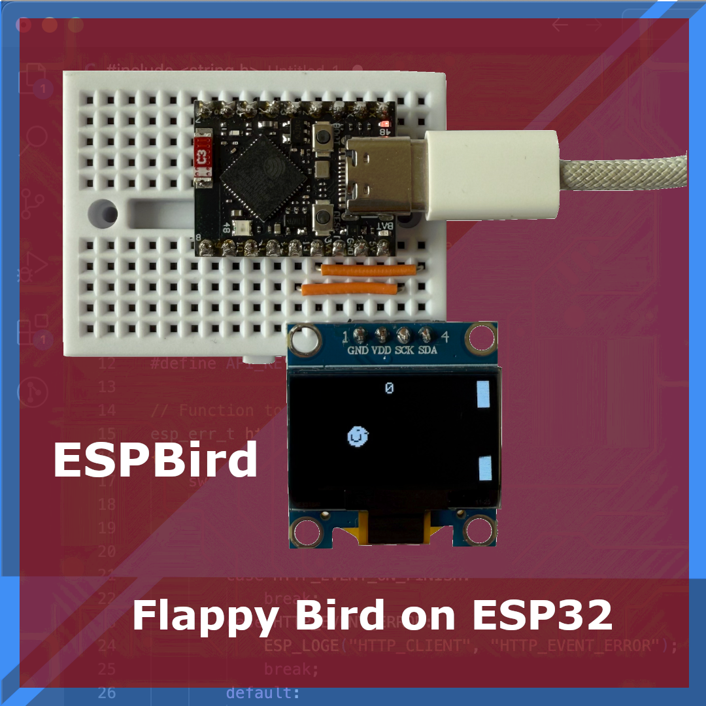

# ESPBird 🐤 — Flappy Bird-Style Game for ESP32-S3 + SSD1306 OLED

A minimalist side-scrolling game inspired by Flappy Bird, built for the ESP32-S3 SuperMini and SSD1306 OLED display. Uses a single pushbutton for input. Designed to run entirely on a 128×64 monochrome screen.



## 🕹 Features

- Bird physics (gravity + jump)
- Randomized scrolling pipes with gaps
- Collision detection and scoring
- Start and Game Over screens
- Sprite-based bird animation (customizable!)
- Runs at ~20 FPS on SSD1306 over I2C

## 🧩 Hardware Required

- ESP32-S3 SuperMini  
- SSD1306 128×64 OLED (I2C version)  
- Tactile button  
- (Optional) Breadboard, jumper wires, buzzer

## 📚 Libraries Used

```cpp
#include <SPI.h>
#include <Wire.h>
#include <Adafruit_GFX.h>
#include <Adafruit_SSD1306.h>
```

All libraries are available via the Arduino Library Manager.

## 🎨 Customize Your Sprite

Use our [Monochrome Bitmap Tool](https://www.espboards.dev/tools/monochrome-bitmap-tool/) to draw and export your own 16×16 bird graphics. Simply replace the default `bird_frame1[]` and `bird_frame2[]` arrays with your own design.

## 📖 Blog Post & Instructions


For full setup, wiring guide, code walkthrough, and customization tips, check out the [ESP Bird tutorial](https://www.espboards.dev/blog/esp-bird-ssd1306-esp32/).

---

Built with fun in mind at [ESPBoards.dev](https://www.espboards.dev) 💡
